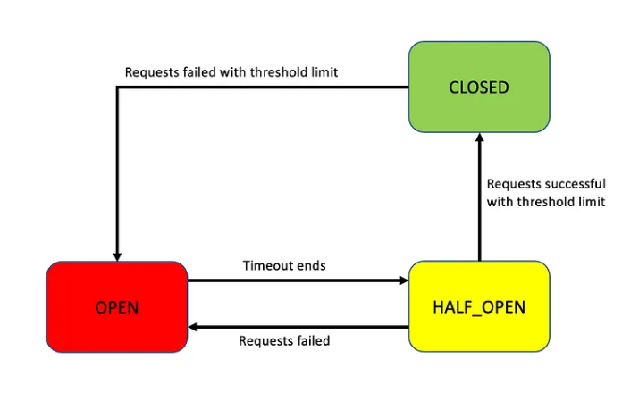

# Circuit breaker

## What?

The idea: Prevent calling a service which is in abnormal behavior (timeout/NA) -> give time to recover

A -> B. B NA -> A's call fails. Next req fails also

-> stop request for a time. Check available later

## States

Circuit breaker states

1/ Closed: API normal -> circuit breaker closed
2/ Open: Failure rate > thresh hold -> open states. After a Time -> Half_open states
3/ Half-open: allow limited req. If fail > thresh hold -> Open states. Else Close states

