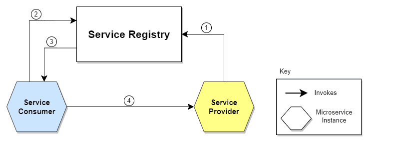

# Service Discovery

## What is it?

A service to identify the location/status of each instance/service in a microservice system.
When a client want to make a request -> must go through Service Discovery

## Why it needed?

### Microservice needs to know location of every service (which might change dynamically)

No Service discovery -> tight coupling

## Service Discovery patterns

Sample architect:

Flows:

1/ The location of the Service Provider is sent to the Service Registry (a database containing the locations of all
available service instances)

2/ The Service Consumer asks the Service Discovery Server for the location of the Service Provider.

3/ The location of the Service Provider is searched by the Service Registry in its internal database and returned to the
Service Consumer.

4/ The Service Consumer can now make direct requests to the Service Provider.

### Client-Side Service Discovery

Service consumer queries Service Registry, load balance request

### Server-Side Service Discovery

Service consumer req to LB -> LB queries Service Registry -> call to service provider

## Service registry

A DB store service location + status

### Service Registry options

1/ Self-registration: register/deregister using heartbeat req

2/ 3rd-party registration: polling deployment environment or sub events.

