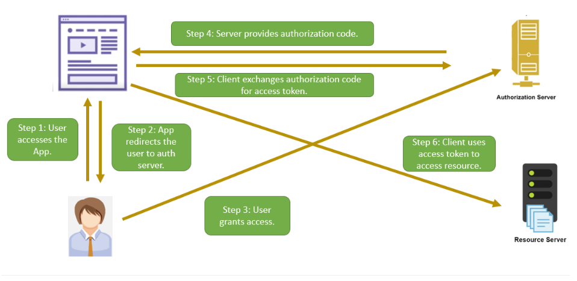

# Authorization Code Grant Type

## What's grant type?

Grant type refers to the way an application gets an access token.

Each grant type is optimized for a particular use, whether that’s a web app, a native app, a device without the ability
to launch a web browser, or server-to-server applications.

## Authorization Code grant type

Most commonly used OAuth 2.0 grant type. Suitable for web/apps that have a backend.

### Step 1 => Authorization request

**Client app** redirects the **resource owner** to the **authorization server’s authorization endpoint**

Query parameters

| Parameter     | Description                                                                                                                                                          |
|---------------|----------------------------------------------------------------------------------------------------------------------------------------------------------------------|
| response_type | This parameter defines the type of response expected. In this flow, it will be "code".                                                                               |
| client_id     | This parameter defines the client's ID that needs access to the resource. In our example, it will be the client ID of the PicsArt app.                               |
| redirect_uri  | This is the URI where the authorization server redirects to after interacting with the resource owner.                                                               |
| scope         | This parameter defines the resources for which access is being requested. It is optional; if not provided, the server uses defaults.                                 |
| state         | The application generates a random string and includes it in the request. It should then verify the same value after user authorization. This prevents CSRF attacks. |

Complete sample req:

> https://authorization.server.dummy.com/authorize
> ?response_type=code
> &client_id=12345
> &redirect_uri=https://client.dummy.com/callback
> &scope=images_read
> &state=abcde

### Step 2 => Authorization response

If user provides consent to auth server -> auth server redirect browser to the **redirect_uri** in request

Auth server response:

| Parameter | Description                                                                                                                                                     |
|-----------|-----------------------------------------------------------------------------------------------------------------------------------------------------------------|
| code      | This is the authorization code generated by the authorization server. It is short-lived and tied to client ID, resource owner, scopes, and redirect URI.        |
| state     | This is the same string passed with the request. It is used for verification purposes, ensuring the integrity of the communication and preventing CSRF attacks. |

Sample response URL

> https://authorization.server.dummy.com/callback
> ?code=hhdf6hsbhjG66hgtgfGGHJGCHJ
> &state=abcde

### Step 3 => Token request

Once client get Authorization code -> exchange code with access token by sending post token request

Request parameters:

| Parameter     | Description                                                                                                                                        |
|---------------|----------------------------------------------------------------------------------------------------------------------------------------------------|
| grant_type    | For this flow, the value will be "authorization_code". This informs the token endpoint that the client is using the Authorization Code grant type. |
| code          | This is the code received in the Authorization Response.                                                                                           |
| client_id     | The client ID of the client.                                                                                                                       |
| client_secret | This is the client secret. It verifies that the request is from a validly registered client and not from an attacker posing as the client.         |

Sample CURL

> POST /token/endpoint HTTP/1.1
>
> Host: authserver.dummy.com
>
> grant_type=authorization_code
> &code=hhdf6hsbhjG66hgtgfGGHJGCHJ  
> &client_id=12345 
> &client_secret=gh5Gdkj743HFG45udbfGfs

### Step 4 -> Token response

The token endpoint verifies all the parameters in the request. It verifies that the code has not expired and the client
id and client secret matches

Sample Response:

> HTTP/1.1 200 OK
> Content-Type: application/json 
> { 
"access_token":"YT3774ghsghdj6t4GJT5hd", 
"token_type":"bearer", 
"expires_in":3600, 
"refresh_token":"YT768475hjsdbhdgby6434hdh", 
"scope":"images_read" 
> }

## Why 2 steps

Why need to get authorization code then exchange with access token later?

**Because it's not safe to share client secret and get access token on the front channel**

> Front channel:  
> Front channel communication involves interactions that occur directly between the user's browser and
> the authorization server or resource server
>
> Back channel:
> Back channel communication refers to interactions that occur directly between the client and the authorization server
> or resource server, without involving the user's browser

