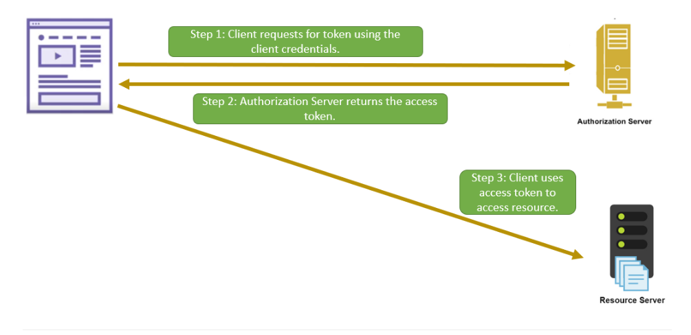

# Client Credentials Grant type

Suitable for machine to machine authorization (No user involved)

Server to Server -> client credentials grant type

## Flow

### Step 1 => Token request

Client directly sends an HTTP Post request to the authorization server

Query params

| Parameter     | Description                                                                                                              |
|---------------|--------------------------------------------------------------------------------------------------------------------------|
| grant_type    | Since we are requesting the access token using the client credentials, this parameter will contain "client_credentials". |
| client_id     | The client ID of the app.                                                                                                |
| client_secret | The client secret of the app.                                                                                            |
| scope         | An optional parameter defining the resources being requested.                                                            |

Sample request

> POST /token/endpoint HTTP/1.1
> Host: authserver.dummy.com
> grant_type=client_credentials
> &client_id=12345
> &client_secret=gh5Gdkj743HFG45udbfGfs
> &scope=images_read

### Step 2 => Token response

If the client credentials are valid, a token is returned by the authorization server

Sample response

> HTTP/1.1 200 OK
> Content-Type: application/json
> {
"access_token":"YT3774ghsghdj6t4GJT5hd",
"token_type":"bearer",
"expires_in":3600,
"refresh_token":"YT768475hjsdbhdgby6434hdh",
"scope":"images_read"
> }

