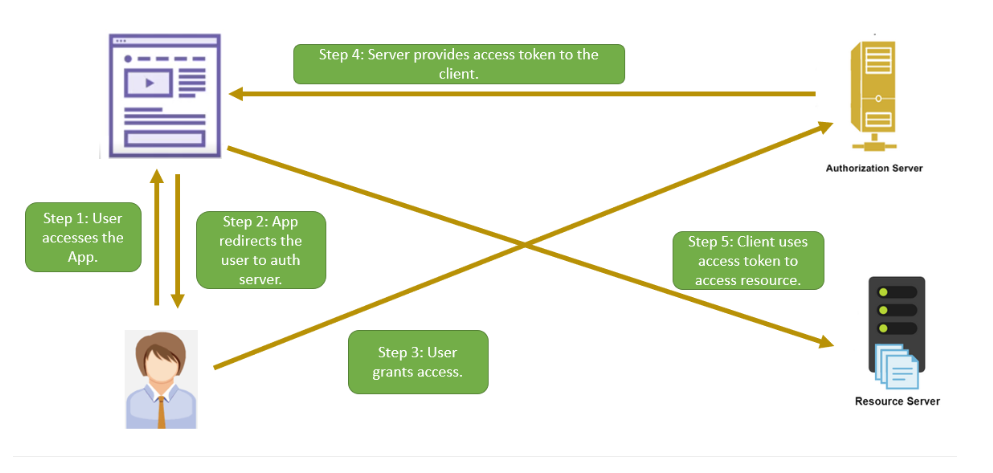

# Implicit Grant Type

Designed for single-page JS apps which don't have Backend.

JS apps without Backend can't store client secret (storing client secret is not safe)

In Implicit flow -> Authorization server directly return access token instead of code

> **IMPORTANT** only use if no alternative option because it's not safe. Exchange of token
> happens in Front end -> attacker can access token

## Flows

### Step 1 => Authorization Request

Query parameters

| Parameter     | Description                                                                                               |
|---------------|-----------------------------------------------------------------------------------------------------------|
| response_type | Since we are requesting the access token directly, this parameter will contain "token".                   |
| client_id     | The client ID of the app.                                                                                 |
| redirect_uri  | The URI to which the authorization server redirects after interacting with the resource owner.            |
| scope         | An optional parameter defining the resources being requested.                                             |
| state         | This parameter is optional in this flow. It can be used for maintaining state or preventing CSRF attacks. |

Sample URL

> https://authorization.server.dummy.com/authorize
> ?response_type=token
> &client_id=12345
> &redirect_uri=https://client.dummy.com/callback
> &scope=images.read
> &state=abcde

### Step 2 => Authorization Response

Once the user authenticates and provides permissions to the authorization server, it will redirect the browser to
redirect_url specified by the client app in the request. The authorization server will then add a token and state to the
fragment part of the URL.

Sample response:

> https://authorization.server.dummy.com/callback
> #access_token=hhdf6hsbhjG66hgtgfGGHJGCHJ
> &token_type=bearer
> &expires_in=500
> &state=abcde

