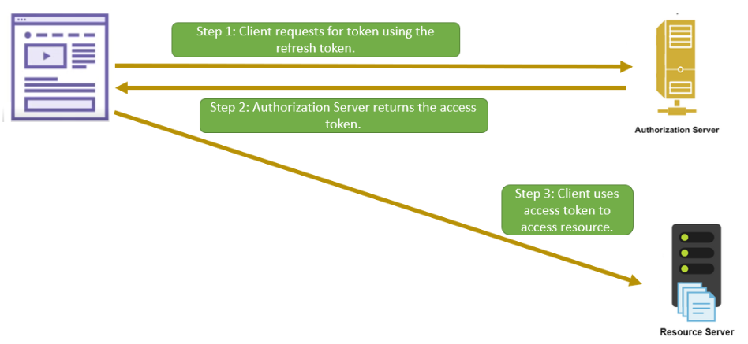

# Refresh Token Grant

Access token only valid for a certain in time -> ensure security

Authenticate and authorize every time after expiration -> frustrating

Different settings -> Some tokens are single-use, other multiple times.

Refresh token should not be leaked.

## Flow

### Step 1 => Refresh token request

Query params

| Parameter     | Description                                 |
|---------------|---------------------------------------------|
| grant_type    | The value for this flow is "refresh_token". |
| refresh_token | The refresh token.                          |
| client_id     | The client ID.                              |
| client_secret | The client secret.                          |

Sample URL

> POST /oauth/v2/accessToken HTTP/1.1
> Host: authserver.dummy.com
> Content-Type: application/x-www-form-urlencoded
> grant_type=refresh_token
> &refresh_token=k3hjJE5x1lZh-zjU-02w8EJW6l2jnuP8F1uXMgkm8nzjPfnaJR
> &client_id=12345
> &client_secret=hhdHFgggdFGfhd

### Step 2 => Refresh token response

If the client credentials are valid and the refresh token has not expired, then an access token is returned

> HTTP/1.1 200 OK
> Content-Type: application/json
> {
"access_token": "dgfYTGFVygPtyqytVfyGFtyF",
"expires_in": 3600,
"refresh_token": "GHcdkHJjcbhhBHJGbhjfgkHghB",
"refresh_token_expires_in": 500000
> }

## Flow that not apply

Implicit grant type: no where to store refresh token
Client credentials grant type: no user -> no need to refresh