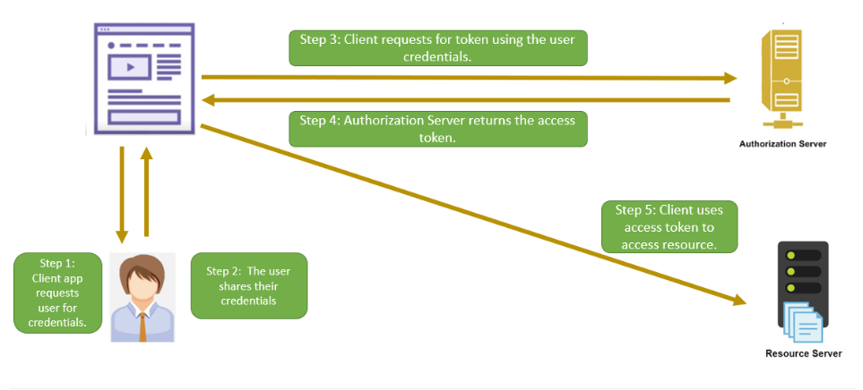

# Resource Owner Credentials Grant

The Resource Owner password credentials grant type is used in cases where the resource owner trusts the client and is
ready to share its credentials with the client

Use only if other flows are not viable

## Flow

### Step 1 => Token request

In this flow, the client collects the credentials from the user and sends a POST request to the authorization server

Query params

| Parameter     | Description                            |
|---------------|----------------------------------------|
| response_type | The value for this flow is "password". |
| client_id     | The client ID.                         |
| client_secret | The client secret.                     |
| username      | The username of the user.              |
| password      | The user password.                     |
| scope         | Defines the resources to be accessed.  |

Sample URL

> POST /token/endpoint HTTP/1.1
> Host: authserver.dummy.com
> grant_type=password
> &client_id=12345
> &client_secret=gh5Gdkj743HFG45udbfGfs
> &username=Jone@xyz.com
> &password=abcde
> &scope=images_read

### Step 2 => Token response

Sample response

> HTTP/1.1 200 OK
> Content-Type: application/json
> {
"access_token":"YT3774ghsghdj6t4GJT5hd",
"token_type":"bearer",
"expires_in":3600,
"refresh_token":"YT768475hjsdbhdgby6434hdh",
"scope":"images_read"
> }

