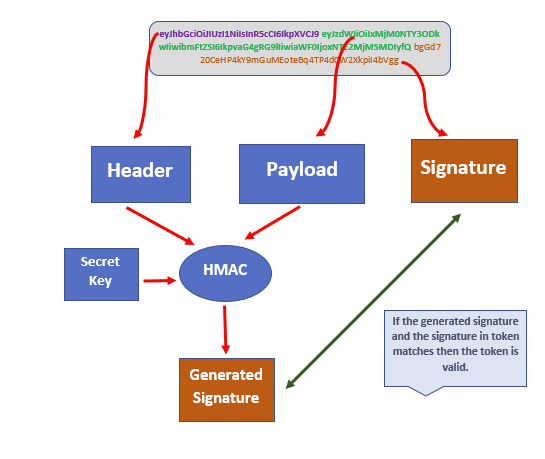

# JWT - JSON Web Token

## What?

Standard for a safe, compact and self-contained way of transmitting information between
server + client.

JWT can be signed (JWS) or encrypted (JWE) or both. If neither -> insecure JWT

Signing JWT -> maintain integrity. All can see but none can modify

Encrypting JWT -> maintain secrecy. None can see data but if thing changed -> not
able to find out

## Structure

3 String separated by a dot

### Header

Describes what algorithm is used to sign or encrypt the data contained in the JWT.
The header defines two attributes:

a) alg: the algorithm used to sign or encrypt the JWT.

b) typ: the content that is being signed or encrypted.

The header JSON looks like as shown below.

Now when we encode it to base64encode, we get the first part of our JSON web token

### Payload

This is the second part of JWT.
It contains the main information that the server uses to identify the user and permissions.
The payload consists of claims.
Claims are statements about an entity (typically the user) and additional data

#### Registered Claim names

| Key | Description                                                                                                                                                                                                                                                                                                                         |
|-----|-------------------------------------------------------------------------------------------------------------------------------------------------------------------------------------------------------------------------------------------------------------------------------------------------------------------------------------|
| iss | Identifies the principal that issued the JWT.                                                                                                                                                                                                                                                                                       |
| sub | Identifies the principal that is the subject of the JWT.                                                                                                                                                                                                                                                                            |
| aud | Identifies the recipients that the JWT is intended for.                                                                                                                                                                                                                                                                             |
| exp | Identifies the expiration time at or after which the JWT MUST NOT be accepted for processing.                                                                                                                                                                                                                                       |
| nbf | Identifies the time before which the JWT MUST NOT be accepted for processing.                                                                                                                                                                                                                                                       |
| iat | Identifies the time at which the JWT was issued.                                                                                                                                                                                                                                                                                    |
| jti | The JWT ID is a unique identifier for the JWT. The identifier value MUST be assigned in a manner that ensures that there is a negligible probability that the same value will be accidentally assigned to a different data object. It can be used to prevent the JWT from being replayed. This is helpful for a one-time use token. |

#### Public Claim names

Public claim names are JSON Web Token Claims that can be defined at will by those using JWTs. However, in order to
prevent collisions, any new claim name SHOULD either be defined in the IANA Registry, JSON Web Token Claims Registry, or
be defined as a URI that contains a collision resistant namespace

#### Private Claim names

A producer and consumer of a JWT may agree to any Private claim name that is not a Reserved claim name or a Public claim
name. Unlike Public claim names, these Private claim names are subject to collision and should be used with caution.

The payload JSON looks like as shown below.

### Signature

The third and final part of JWT is the signature. It is created by combining the header and payload parts of JWT and
then hashing them using a secret key

Since this is a signature, if someone tries to decode it they will not be able to get the JSON

## Common use case

- Authorization
- Info exchange

## JWT validation

### How tokens are signed

Symmetric signature: JWT signed using a secret key. 1 server sign and validate tokens. Use HMAC

Asymmetric Signatures: suitable for distributed scenarios. multiple applications that can validate a given JWT. If we
use a secret key to sign a JWT, then these applications will need that key to validate the token
uses a private-public key pair for signing. There is one server that has the private key. This server generates the
tokens, signs them using the private key, and shares it with the client

When a server receives a token, it fetches the header and payload from that token.
It then uses the secret key or the public key (in the case of asymmetric signing) to generate the signature from the
header and payload.
If the generated signature matches the signature provided in the JWT, then it is considered to be valid

### Claim validations

Check if the token is still valid. This can be validated through exp claim
Validate that the token is actually meant for you through the aud claim
Check if the token can be used at this time using the nbf claim.
