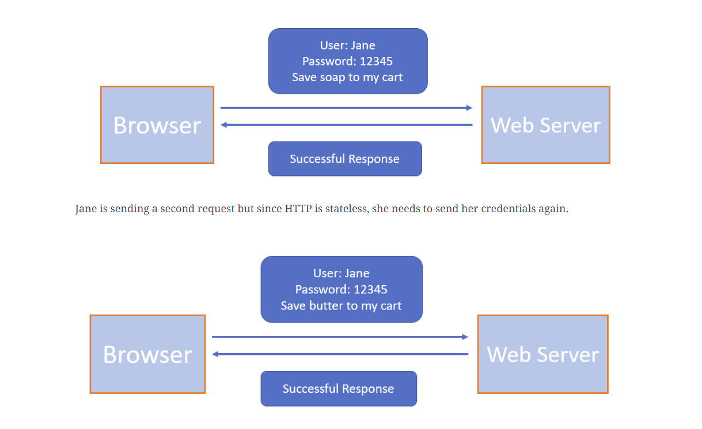
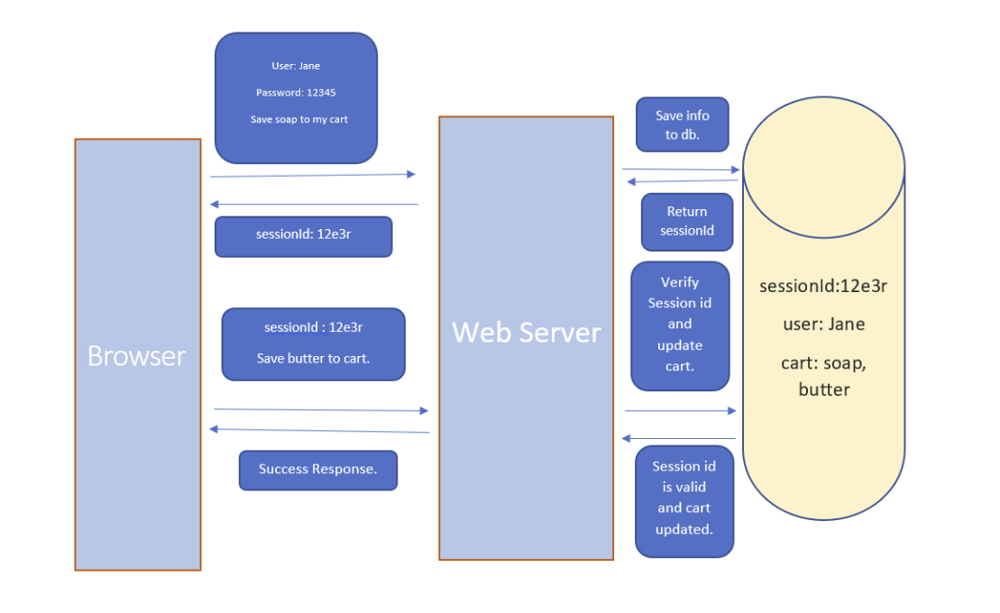

# Session-based Authentication

## Overview

Http stateless (each HTTP request is considered as independent request) -> 
no info from previous request.

If website need to identify customer -> each HTTP req 
need to send additional info

## Session based Auth

Send credentials each req -> risky + frustrating
-> session-based auth or cookie-based auth

1. The user (normally a browser) sends a request to the server. 
The request contains the login credentials of the user 
and the info it is requesting.
2. The web server authenticates the user. 
It creates a session and stores all the information about the user in memory or a database 
and returns a sessionId to the user
3. This sessionId is stored by the user in browser cookies. 
The next time the user makes a request 
it sends the cookies as well in the HTTP header
4. The web server looks at the sessionId and 
checks if it has any info regarding this sessionId
5. If the sessionId is valid then 
the web server recognizes the user and returns the requested information

## Cons

1. Distributed systems -> need to store sessionId in all server
2. Query DB or memory for sessionId -> performance cost
3. Cookie fraud