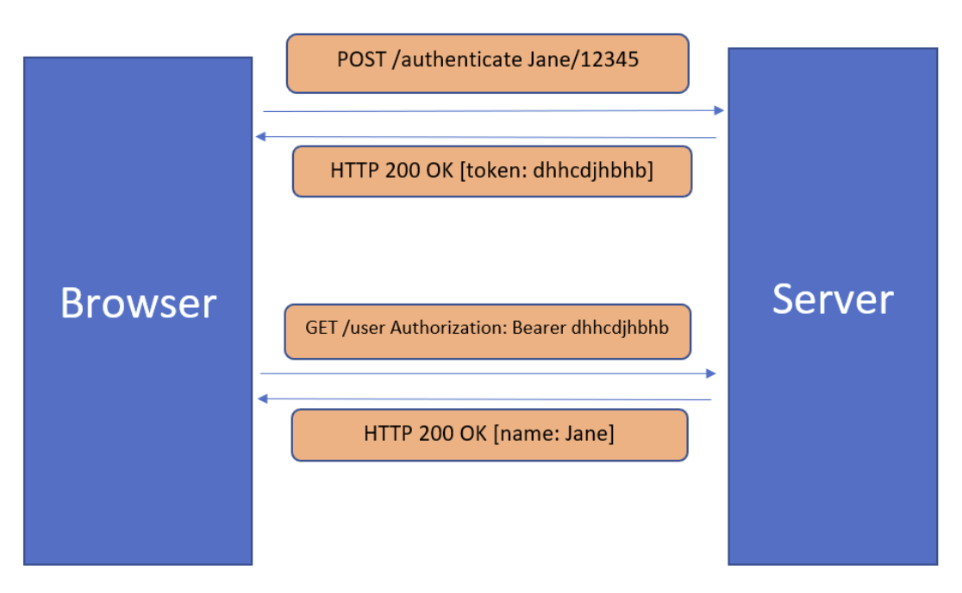

# Token Based Authentication

## Overview

Don't want to save user information in server + 
Don't want to save user information in cookies

-> store in token

Token = Encrypted information + stored in client-side

## Token-based Authentication basic flow

1. Client send req to server with username/password
2. Application validate credential and generate secure+signed token
3. Client receive and store token.
4. Next request sends token to server through HTTP header
5. Server decode and verifies token
6. Client log out -> destroy token

## Pros

1. Scalability + statelessness
Truly stateless. Server doesn't store any client information -> fit for
distributed system
2. More secure
Token expired after time + encrypted
3. Can be generated anywhere
Can delegate generating task to other apps
4. Helpful in Authorization
Can specify resources that user can access

## Types of token

### Access Token

Access tokens are used to grant access to a protected resource. 
When a client first authenticates it is given both types of tokens, 
but the access token is set to expire after a short period
-> if token fraud -> only for short time

### Refresh Token

Refresh tokens are used to obtain a new access token 
when the current access token becomes invalid or expires, 
or to obtain additional access tokens with an identical or narrower scope

It does not need the credential information again. 
The refresh token is also valid for some duration, 
but it is much more than an access token.

> Although the refresh token does not need the user’s credentials again to generate an access token, 
> it still requires the client id and client secret (we will look at these terms in OAuth lessons). 
> So even if attackers get a refresh token, they will not be able to get the access token.

Most common -> JWT