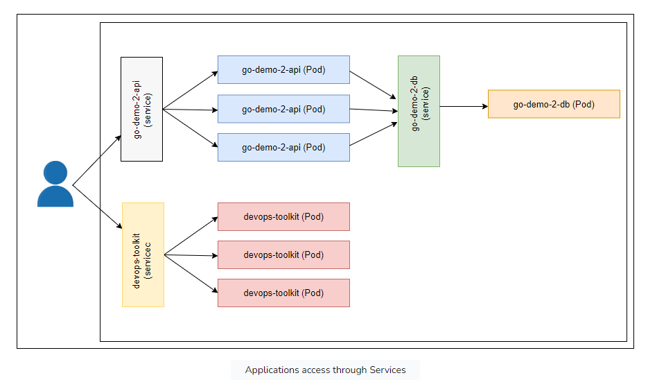
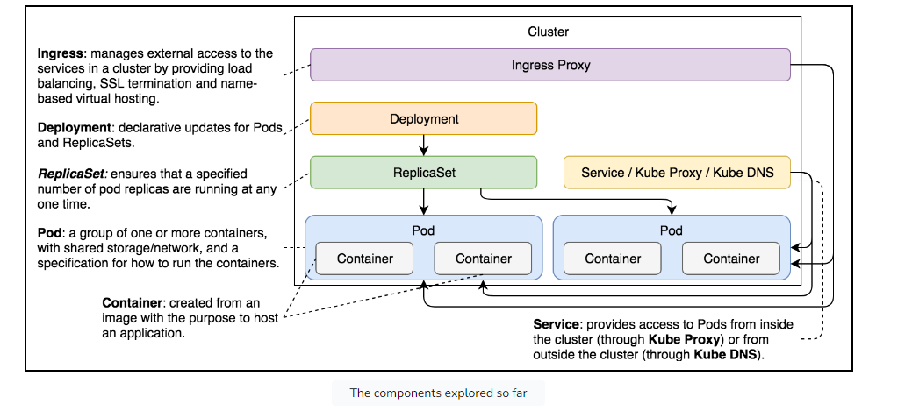

# Ingress

Applications that are not accessible to users are useless. Kubernetes Services provide accessibility with a usability
cost. Each application can be reached through a different port. We cannot expect users to know the port of each service
in our cluster

Ingress objects manage external access to the applications running inside a Kubernetes cluster

## Problem with service only

Not recommend to publish fixed port through Services due to

- Conflict ports
- Need to keep track of which port belongs to which server

Context

cannot expect our users to know specific ports behind each of those applications
-> make all services accessible through standard HTTP (80) or HTTPS (443) ports

## Ingress Controller

Need a mechanism that will accept requests on predefined ports (e.g., 80 and 443) and forward them to Kubernetes
Services

## Ingress process

### Creation process

## Default backend Ingress resource

The spec has no rules but only a single backend
When an Ingress spec is without rules, it is considered a default backend. It will forward all requests that do not
match paths and/or domains set as rules in the other Ingress resources.

