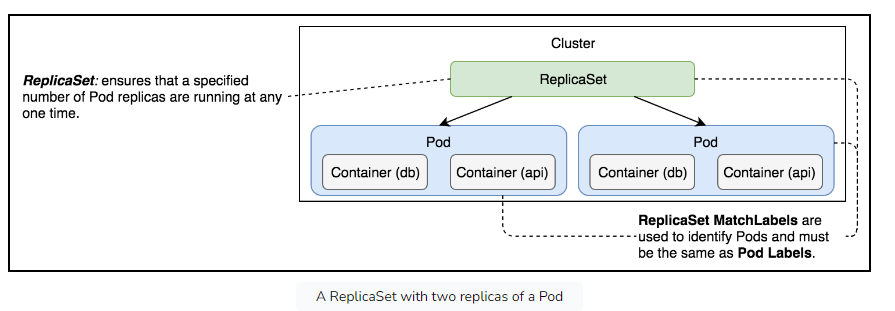
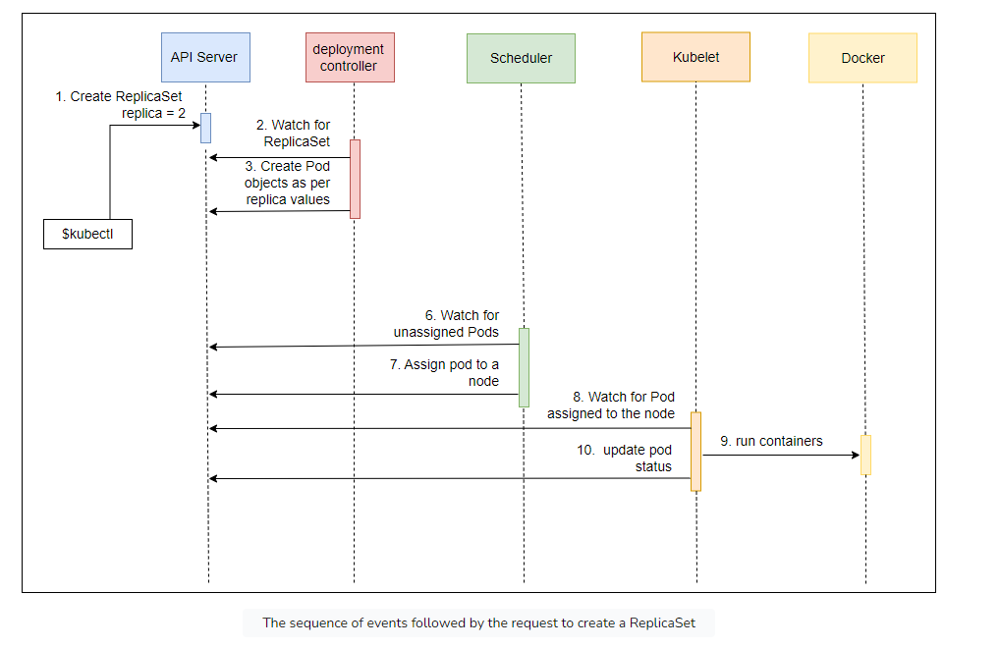

# ReplicaSets in K8s

Some insights:

- Pods are not fault-tolerant
- If pod is created without controller -> nothing manage pods when fail

## Replica sets

1 of Controllers.

Primary function: ensure a specified number of replicas match pod states -> make pods scalable

Main idea: As long as conditions are met (CPU, memory...) -> Pods in Replicaset guaranteed to run

### Creating replica sets

Sample

```yaml
apiVersion: apps/v1
kind: ReplicaSet
metadata:
  name: go-demo-2
spec:
  replicas: 2
  selector:
    matchLabels:
      type: backend
      service: go-demo-2
  template:
    metadata:
      labels:
        type: backend
        service: go-demo-2
        db: mongo
        language: go
    spec:
      containers:
        - name: db
          image: mongo:3.3
        - name: api
          image: vfarcic/go-demo-2
          env:
            - name: DB
              value: localhost
          livenessProbe:
            httpGet:
              path: /demo/hello
              port: 8080
```


### Sequences


