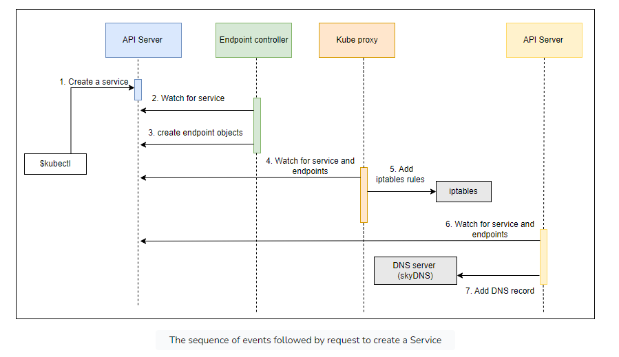

# Service in K8s

The problem: Pods + ReplicaSets have no communication path
-> current pods can't communicate with each other

-> K8s Service to associate pods

## Services by exposing ports

```shell
kubectl expose rs go-demo-2 \
    --name=go-demo-2-svc \
    --target-port=28017 \
    --type=NodePort
```

-> target port will be exposed on every node of the cluster to the outside world and be routed to one of the Pods
controlled by the ReplicaSet

## Types of Services

### ClusterIP

ClusterIP (the default type) exposes the port only inside the cluster.
Such a port would not be accessible from anywhere outside.
ClusterIP is useful when we want to enable communication between Pods and still prevent any external access

### Load balancer

The LoadBalancer type is only useful when combined with the cloud provider’s load balancer.

### ExternalName

ExternalName maps a Service to an external address

## Sequence



## Declarative Syntax

```yaml
apiVersion: v1
kind: Service
metadata:
  name: go-demo-2
spec:
  type: NodePort
  ports:
    - port: 28017
      nodePort: 30001
      protocol: TCP
  selector:
    type: backend
    service: go-demo-2
```

In this case, we define that the Service should forward requests to Pods with 
labels type set to backend and service set to go-demo. 
Those two labels are set in the Pods spec of the ReplicaSet
