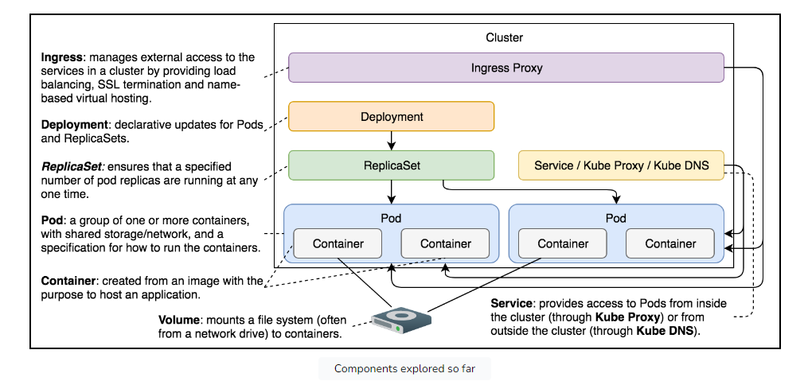

# Volume

## State preservation

Most of the time, stateful applications store their state on disk. This leaves us with a problem. If a container
crashes, kubelet will restart it. The problem is that it will create a new container based on the same image. All data
accumulated inside a container that crashed will be lost

## K8s Volume

Kubernetes volumes solve the need to preserve the state across container crashes. In essence, volumes are references to
files and directories that are accessible to containers that form a Pod

Diff types of K8s volume -> the way file/dir created

## Hands-on

Define volumeMounts:

- mountPath: Where we expect to mount INSIDE THE CONTAINER
- name: name of the volume

Define the volume:

The hostPath volume allows us to mount a file or a directory from a host to Pods and, through them, to containers

Note: Do not use hostPath to store a state of an application. Since it mounts a file or a directory from a host into a
Pod, it is not fault-tolerant. If the server fails, Kubernetes will schedule the Pod to a healthy node, and the state
will be lost

## Host path to inject configuration

```yaml
apiVersion: apps/v1
kind: Deployment
metadata:
  name: prometheus
spec:
  selector:
    spec:
      containers:
        volumeMounts:
          - mountPath: /etc/prometheus/prometheus.yml
            name: prom-conf
      volumes:
        - name: prom-conf
          hostPath:
            path: /files/prometheus-conf.yml
            type: File
...
```

-> files in host available inside container
-> But not a good idea
A hostPath volume maps a directory from a host to where the Pod is running. Using it to “inject” configuration files
into containers would mean that we’d have to make sure that the file is present on every node of the cluster

For e.g:
Consider a Pod that mounts /var/log/myapp from the host. If the Pod gets scheduled to a node where /var/log/myapp
doesn't exist or contains different files, the Pod won't function as intended

## Maintain states

When Kubernetes recreates the failed container, it creates a new one from the same image. Everything we generated inside
the running container is no more. We reset to the initial state

### Use empty dir volume type

```yaml
...
kind: Deployment
...
spec:
  ...
  template:
    ...
    spec:
      containers:
        ...
        volumeMounts:
            - mountPath: /var/jenkins_home
              name: jenkins-home
      volumes:
        - emptyDir: { }
          name: jenkins-home
...
```

An emptyDir volume is created when a Pod is assigned to a node. It will exist for as long as the Pod continues running
on that server

When a container crashes, a Pod is not removed from the node. Instead, Kubernetes will recreate the failed container
inside the same Pod and, therefore, preserve the emptyDir volume

There is an unwritten assumption that emptyDir is used for testing purposes and will be changed to something else before
it reaches production


